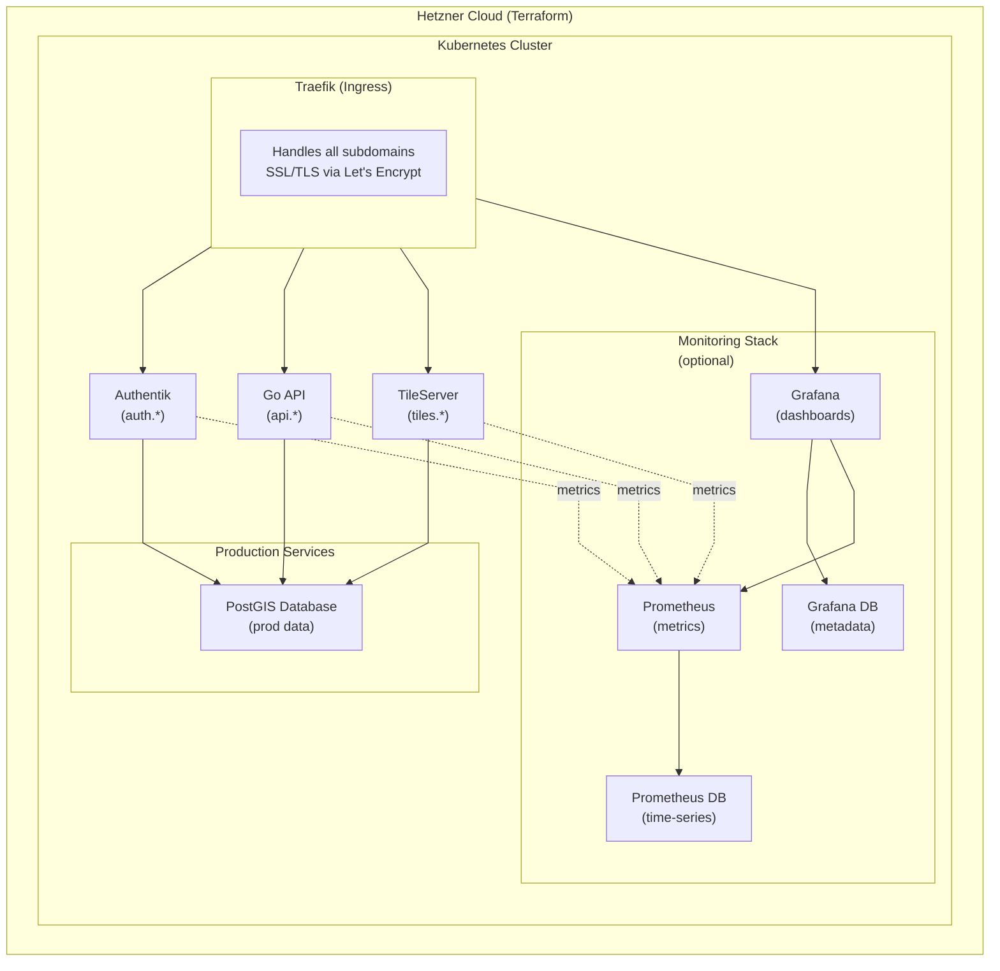

# Freiwasser Implementation Roadmap

## 🎯 Project Overview

OSM-based mapping platform with:
- Public low-precision tile access (no auth required)
- Authenticated region-based tile access (role-based)
- Role-based data contribution system
- Multi-region support (Europe MVP → paid regions later)

---

## 📋 Tech Stack

### Infrastructure
- **Cloud**: Hetzner Cloud (Terraform)
- **Container Orchestration**: Kubernetes
- **Ingress/Proxy**: Traefik (for subdomain routing)
- **Secrets**: SOPS (git-ignored)
- **SSL/TLS**: Let's Encrypt (Traefik handles auto-renewal)

### Backend Services
- **API**: Go REST API (custom)
- **Auth**: Authentik (OAuth2/OIDC) → JWT claims
- **Tile Server**: TileServer GL or similar
- **Database**: PostGIS (PostgreSQL)
- **OSM Processing**: Osmium or Tegola

### Monitoring Stack (Optional)
- **Metrics Collection**: Prometheus
- **Dashboards**: Grafana
- **Monitoring Database**: Separate PostgreSQL for Prometheus & Grafana metadata
- **Note**: Monitoring stack is isolated from production PostGIS database

### Static Assets
- Separate subdomain or S3-like storage

---

## 🏗️ Architecture Overview



---

## 🔄 Data Flow

### Public Tile Access (No Auth)
```
Client → Traefik → TileServer → API (fetch low-precision tiles)
         (tiles.*)                   ↓ Query Region/Auth Check
                              PostGIS (public data only)
```

### Authenticated Access
```
Client → Authentik → JWT Token → API → Traefik → TileServer
(auth.*)              (embed region +    (validate JWT + region)
                      permissions)             ↓
                                       PostGIS (user's regions)
```

### Data Contribution
```
Client → API (auth required) → Validate permissions → PostGIS
(api.*)  (check region + role)     (role: contributor)
```

---

## 📦 Terraform Modules

```
infrastructure/
├── main.tf
├── variables.tf
├── outputs.tf
├── provider.tf (Hetzner)
├── secrets.sops.yaml (git-ignored, loaded via sops exec-env)
│
├── modules/
│   ├── kubernetes/       # K8s cluster setup
│   ├── network/          # VPC, firewall
│   ├── database/         # PostGIS (production)
│   ├── monitoring_db/    # PostgreSQL for Prometheus & Grafana (separate)
│   ├── storage/          # S3 bucket for static assets / backups
│   └── monitoring/       # Prometheus + Grafana setup (optional)
│
└── k8s-manifests/        # K8s YAML (applied post-infrastructure)
    ├── traefik/
    ├── authentik/
    ├── api/
    ├── tileserver/
    └── monitoring/          # Prometheus & Grafana (optional)
        ├── prometheus/
        └── grafana/
```

### SOPS Integration
```bash
# Decrypt and run Terraform
sops exec-env ./infrastructure/secrets.sops.yaml \
  'terraform -chdir=infrastructure plan'

sops exec-env ./infrastructure/secrets.sops.yaml \
  'terraform -chdir=infrastructure apply'
```

---

## 🚀 Implementation Phases

### Phase 1: Core Infrastructure (Weeks 1–2)
- [ ] Terraform: Hetzner K8s cluster
- [ ] Terraform: PostgreSQL + PostGIS
- [ ] Terraform: Network, firewall, security groups
- [ ] Traefik: Deploy + configure subdomains
- [ ] Let's Encrypt: SSL certificate automation

### Phase 2: Authentication (Weeks 2–3)
- [ ] Authentik: Deploy on K8s
- [ ] Authentik: Configure OAuth2/OIDC
- [ ] JWT claims: regions, roles
- [ ] API middleware: JWT validation + region checks

### Phase 3: API & Data (Weeks 3–4)
- [ ] Go REST API scaffold
- [ ] TileServer GL deployment
- [ ] OSM data import (Europe MVP)
- [ ] Region metadata (regions.json pattern)
- [ ] Tile access control:
  - Public endpoints (low-precision grid)
  - Authenticated endpoints (high-precision, role-based)

### Phase 4: Data Contribution (Week 5)
- [ ] API endpoints: POST/PUT for data submission
- [ ] Role-based validation (can user edit region X?)
- [ ] PostGIS updates from API
- [ ] Audit logging

### Phase 5: Monitoring & Optimization (Week 6)
- [ ] Prometheus deployment + scrape configs
- [ ] Separate monitoring PostgreSQL database
- [ ] Grafana dashboards (if capacity)
- [ ] K8s autoscaling rules
- [ ] Performance tuning

### Phase 6: Multi-Region Support (Future)
- [ ] Additional OSM datasets
- [ ] Terraform variable: `enabled_regions`
- [ ] Zero-downtime region additions

---

## 🔐 Security & Access Control

| Access Level | Region | Auth Required | Role |
|---|---|---|---|
| Public | Europe | No | None |
| Registered User | Europe | Yes | viewer |
| Registered User | Other | Yes (paid tier) | viewer |
| Editor | Any | Yes | contributor |
| Admin | Any | Yes | admin |

### JWT Claims (from Authentik)
```json
{
  "sub": "user-uuid",
  "email": "user@example.com",
  "roles": ["viewer", "contributor"],
  "regions": ["eu", "asia"],  // permitted regions
  "tier": "paid"              // "free" or "paid"
}
```

---

## 📦 Deployment Checklist

- [ ] **Secrets Management**: `secrets.sops.yaml` with:
  - Hetzner API token
  - PostgreSQL password
  - Authentik admin password
  - SSL/TLS certs (auto-renewed by Traefik)

- [ ] **DNS Setup**:
  - `api.freiwasser.org` → Load balancer IP
  - `auth.freiwasser.org` → Traefik
  - `tiles.freiwasser.org` → Traefik
  - `static.freiwasser.org` → Traefik (optional)
  - `grafana.freiwasser.org` → Traefik (optional)

- [ ] **K8s Resources**:
  - Namespaces: `default`, `authentik`, `monitoring`
  - PersistentVolumes for production database (PostGIS)
  - PersistentVolumes for monitoring database (separate)
  - ConfigMaps for region metadata
  - Secrets for credentials

- [ ] **Monitoring Stack** (if capacity allows):
  - Prometheus scrape targets: API, TileServer, Authentik, Traefik
  - Separate PostgreSQL for Prometheus time-series & Grafana metadata
  - Grafana dashboards for:
    - K8s cluster health
    - Production database metrics
    - API response times & error rates
    - Tile server cache hit ratio
    - Resource utilization

---

## 🎯 MVP Success Criteria

✅ Infrastructure automated via Terraform
✅ Public tile access works without auth
✅ Authenticated users can access permitted regions
✅ Data contributors can submit updates
✅ SSL/TLS working across all subdomains
✅ Secrets properly managed with SOPS
✅ K8s cluster healthy and scalable

---

## 🗺️ MVP ARCHITECTURE: EUROPE ONLY (modular for future regions)
Goal

✔️ Start with Europe only → cheapest dataset, fastest import
✔️ One PostGIS database
✔️ Tegola serves tiles by region
✔️ Later: attach additional region datasets without breaking anything
✔️ Region logic implemented via Go API only → NOT in DB or Tegola

📦 FILE STRUCTURE (Recommended)
osm-stack/
 ├─ data/
 │   ├─ europe.osm.pbf       ← first region
 │   ├─ regions.json         ← metadata of served regions
 │   └─ extra/               ← future paid regions
 │
 ├─ tegola-configs/
 │   ├─ europe.toml
 │   └─ world.toml           ← future, optional
 │
 ├─ api/
 │   └─ go-server/
 │
 ├─ auth/                    ← authentik / JWT claims
 │
 ├─ docker-compose.yml
 └─ README.md

🧠 Key Design Idea: Regions Are Metadata — Not Separate Databases

Create regions.json:

[
  {
    "id": "eu",
    "name": "Europe",
    "file": "data/europe.osm.pbf",
    "bbox": [ -11.0, 34.5, 31.5, 71.5 ]
  }
]


In Go API:

type Region struct {
    ID   string   `json:"id"`
    Name string   `json:"name"`
    BBox []float64 `json:"bbox"`
}

var regions []Region // load from regions.json on startup


Later, when upgrading to “paid regions”, just append to JSON:

{
  "id": "asia",
  "name": "Asia",
  "file": "data/asia.osm.pbf",
  "bbox": [ 24.0, -1.0, 154.0, 55.0 ],
  "paid": true
}

🚀 DATABASE DESIGN (SIMPLE & FUTURE SAFE)
One database — but use region column:
ALTER TABLE planet_osm_point ADD COLUMN region text;
UPDATE planet_osm_point SET region = 'eu';


Later:

UPDATE planet_osm_point SET region = 'asia' WHERE ST_Within(way, ST_GeomFromText('POLYGON(...)'));


Query filter:

SELECT * FROM planet_osm_point WHERE region = $1;


➡️ No schema migration required
➡️ One DB, low-maintenance
➡️ Easy region-based billing

🧩 TEGOLA CONFIG
[[maps]]
name = "europe"
layer = [
    { name = "roads",    region = "eu" },
    { name = "buildings", region = "eu" }
]


Later (paid regions):

[[maps]]
name = "asia"
layer = [
    { name = "roads",    region = "asia" },
    { name = "buildings", region = "asia" }
]

🔐 AUTHENTICATION & REGION ACCESS
Proposed rules:
Region	Access
Europe	Free / no auth
Other regions	Need token / paid flag
Admin	All regions

JWT claim example (authentik):

{
  "user": "abc",
  "paid_regions": ["asia", "usa"]
}


Go middleware:

func CanAccessRegion(region string, claims Claims) bool {
    if region == "eu" { return true }
    for _, r := range claims.PaidRegions {
        if r == region { return true }
    }
    return false
}

💾 TERRAFORM – RESOURCE LAYOUT
module "osm" {
  source = "./modules/osm-core"  # always active
}

module "auth" {
  source = "./modules/authentik" # optional
}

module "storage" {
  source = "./modules/regions"   # future add-ons
  regions_enabled = ["asia", "usa"] # toggle per env
}


➡️ Paid regions activated just by adding a string to a TF list.

🧭 MVP → SCALE-UP ROADMAP
Phase 1 – Europe only (MVP)

DB with region = 'eu'

Go API → no billing logic yet

Tegola → only EU tiles

Phase 2 – Prep for paid regions

Add JWT middleware

Add region filtering in SQL queries

Add tier list in Go

Phase 3 – Sell paid regions

Download new .osm.pbf

Import in background

Add to regions.json

Update Terraform list

DONE → no breaking changes 🎉

🎯 TL;DR

Make regions “metadata,” not infrastructure.
Regions.json + region column in DB + header-based access control =
scalable + cheap + easy to maintain.
